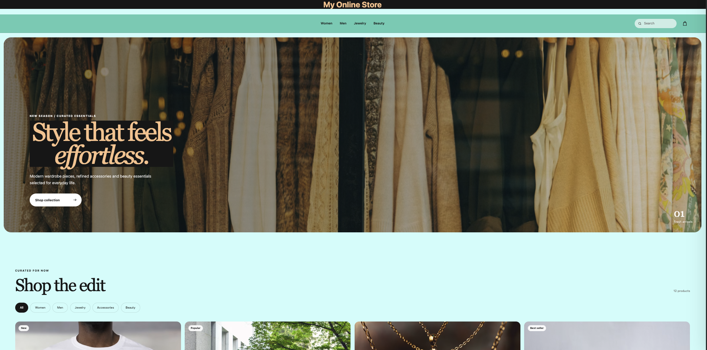
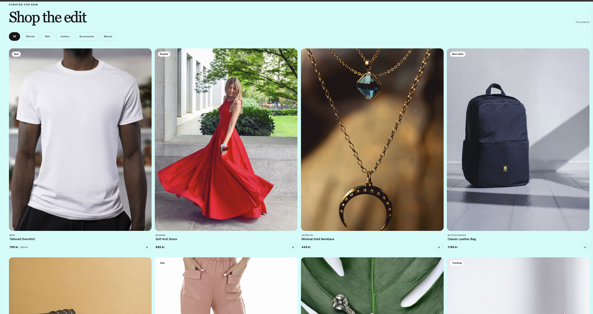
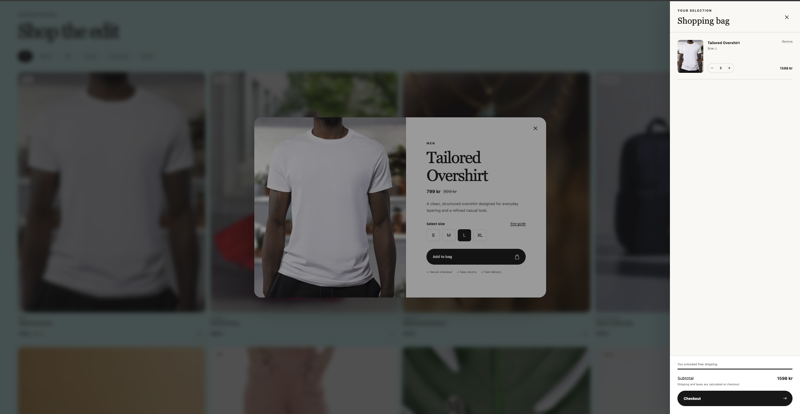

# OnlineStore

OnlineStore is a modern e-commerce frontend built with **React and TypeScript**.

The project focuses on creating a clean, responsive and interactive shopping experience for clothing, jewelry, accessories and beauty products for both women and men.

The frontend is currently the main focus of the project. A backend using **ASP.NET Core / .NET** is planned for a later stage.

---

## Screenshots

### Homepage



### Product Collection



### Shopping Cart & Checkout



---

## Features

* Responsive modern e-commerce design
* Product cards with hover effects and animations
* Product categories and filtering
* Product search
* Detailed product view / Quick View
* Product size selection
* Shopping cart drawer
* Add products to cart
* Remove products from cart
* Increase and decrease quantity
* Automatic cart subtotal
* Free shipping progress indicator
* Smooth scrolling and transitions
* Responsive desktop, tablet and mobile layouts

---

## Technologies

### Frontend

* React
* TypeScript
* HTML / JSX
* CSS
* Vite

### Planned Backend

* ASP.NET Core
* C#
* REST API
* SQL database

The frontend will eventually communicate with the .NET backend through API endpoints for products, users, orders and other store functionality.

---

## Project Structure

```text
OnlineStore/
│
├── screenshots/
│   ├── homepage.png
│   ├── productcard-png.png
│   └── checkout.png
│
├── src/
│   ├── components/
│   ├── context/
│   ├── data/
│   ├── App.tsx
│   ├── main.tsx
│   ├── styles.css
│   └── types.ts
│
├── index.html
├── package.json
├── README.md
├── tsconfig.json
└── vite.config.ts
```

---

## Getting Started

Clone the repository:

```bash
git clone https://github.com/M-Wasif-M/OnlineStore.git
```

Navigate to the project:

```bash
cd OnlineStore
```

Install dependencies:

```bash
npm install
```

Start the development server:

```bash
npm run dev
```

Open the local URL provided by Vite in your browser.

---

## Development Status

OnlineStore is currently under development.

The current development phase focuses on the frontend, user experience and core shopping functionality.

The next stages will focus on building the backend and replacing the current static product data with data provided through a .NET API.

---

## Planned Features

Future development will include features such as:

* ASP.NET Core Web API
* SQL database integration
* User registration and login
* Product database
* Product inventory and stock management
* Multiple product images
* Advanced filtering and sorting
* Wishlist / favorites
* Customer profiles
* Checkout flow
* Order management
* Order history
* Payment integration
* Admin dashboard

---

## Purpose

OnlineStore is being developed as a full-stack e-commerce project with a focus on modern frontend development, reusable React components, TypeScript and future integration with a .NET backend.

The project will continue to evolve as new functionality is implemented.
